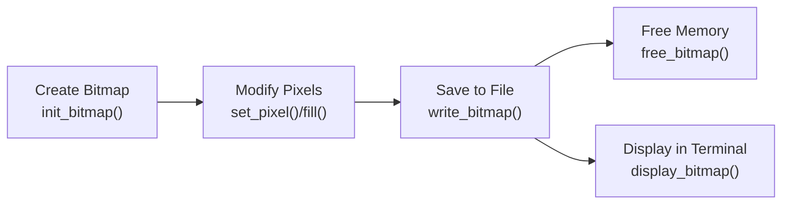

### Introduction

This is a lightweight C implementation for creating, manipulating, and saving bitmap (BMP) image files. This document provides a high-level overview of the source code, including its architecture, core components, and workflow.

### Project Structure

The repository has a simple structure that makes it easy to use. The main files include:

- `src/lib.c` - The core bitmap library implementation
- `src/main.c` - A sample application demonstrating usage
- `build/` - Directory for build artifacts (excluded from version control)

### Function Categories

The implementation functionality is organized into the following categories:

| Category           | Key Functions           | Purpose                                      |
| ------------------ | ----------------------- | -------------------------------------------- |
| Bitmap Creation    | `init_bitmap()`         | Creates a new bitmap of specified dimensions |
| Pixel Manipulation | `set_pixel()`, `fill()` | Modifies pixel colors in the bitmap          |
| File Operations    | `write_bitmap()`        | Saves a bitmap to a BMP file                 |
| Memory Management  | `free_bitmap()`         | Frees memory allocated for a bitmap          |
| Display Functions  | `display_bitmap()`      | Displays a bitmap in the terminal            |

### Workflow

This workflow is demonstrated in the example application (`main.c`), which creates a bitmap of the French flag:

1. Initialize a 30x20 bitmap
2. Fill the left third with blue (`0x0055A4`)
3. Fill the middle third with white (`0xFFFFFF`)
4. Fill the right third with red (`0xF04135`)
5. Save the bitmap to "out.bmp"
6. Free the bitmap memory
7. Display the bitmap in the terminal



### Overview of the BMP Format

The BMP file format is a simple raster graphics file format that stores image data without compression in most cases.

#### File Header Structure

The BMP file header is a 14-byte structure that contains basic information about the file, including its type, size, and where the pixel data begins. The file header is written using the `write_fileheader` function.

| Offset | Size (bytes) | Description          | Implementation                               |
| ------ | ------------ | -------------------- | -------------------------------------------- |
| 0      | 2            | Signature ('BM')     | `fputs("BM", file)`                          |
| 2      | 4            | File size in bytes   | Calculated as header sizes + image data size |
| 6      | 4            | Reserved (always 0)  | Set to 0                                     |
| 10     | 4            | Offset to pixel data | Set to 14 + 40 (header sizes)                |

#### Info Header Structure

The info header follows the file header and contains information about the image dimensions, color format, and other details. Here, the `BITMAPINFOHEADER` variant is 40 bytes long. The info header is written using the `write_infoheader` function.

#### Pixel Data

The pixel data follows the headers and contains the actual color information for each pixel in the image. Here, several important characteristics of the pixel data implementation should be noted:

1. **Color Depth:** Fixed at 24 bits per pixel (8 bits each for red, green, and blue)
2. **Byte Order:** Colors are stored in BGR order (blue, green, red)
3. **Row Order:** Pixels are stored bottom-to-top (the bottom row of the image is stored first)
4. **Row Padding:** Each row is padded to ensure its length is a multiple of 4 bytes

Row padding ensures that each row's size is a multiple of 4 bytes. The padding calculation is handled by the `calc_row_size` function:

```c
row_size = width * 3;                 // 3 bytes per pixel (24-bit color)
row_size += (4 - (row_size % 4)) % 4; // Add padding to reach multiple of 4
```
